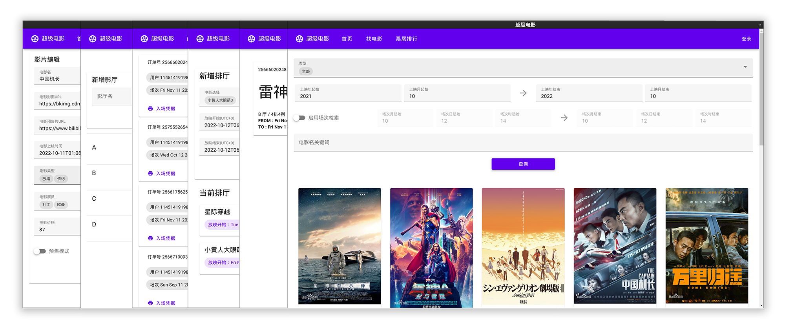

# SuperMoive

现代化的影片管理平台，为跨平台设计。

前端技术栈：Vue3, Vite, Electron, TS, WS  
后端技术栈：C#, F#, PostgreSQL

## 功能列表

 - [x] 影片录入
 - [x] 影厅安排
 - [x] 场次控制
 - [x] 自助购票
 - [x] 订单查询
 - [x] VIP 系统
 - [x] QR Code 扫码检票
 - [x] 支付宝付款接入

